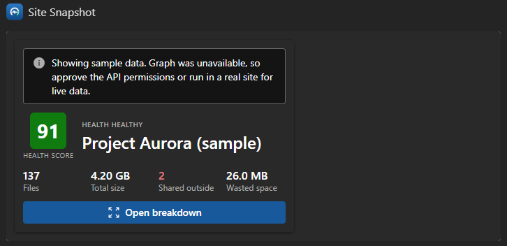
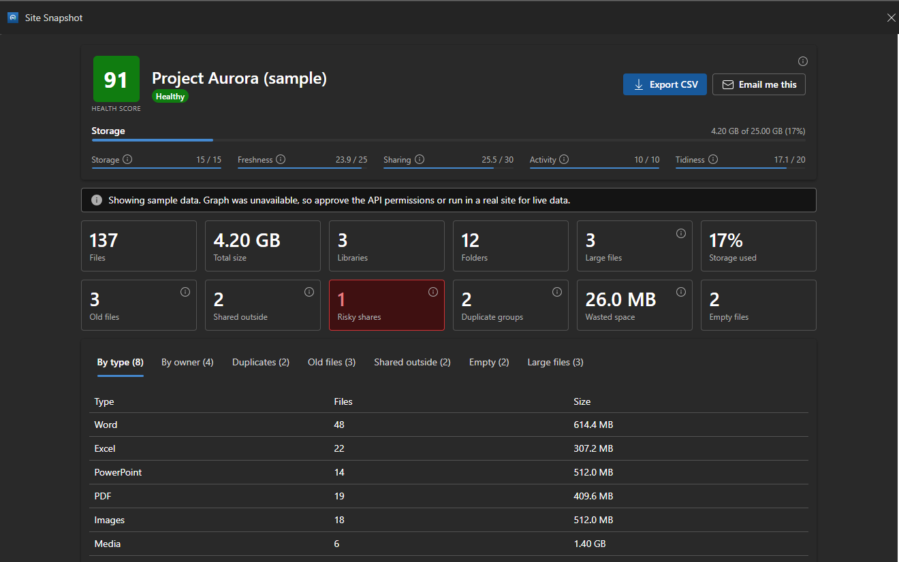

# Site Snapshot - SharePoint Site Health Copilot App

## Summary

Site Snapshot is an SPFx Copilot UX Component, packaged with a declarative agent, that gives an on-demand **health snapshot** of a SharePoint site inside Microsoft 365 Copilot. Ask "how healthy is the Marketing site?" and the agent scans every user document library on the site and returns a 0-100 health score built from five explained sub-scores, plus the detail behind it: stale documents, external and "Anyone" sharing, duplicates and the space they waste, large and empty files, and a breakdown by file type and owner.

Inline, the component renders a compact score card in the chat. Select **Open breakdown** to expand it to a fullscreen dashboard, where you can export the results to CSV or email yourself a summary. The component is read-only: it never changes the site.





## Compatibility


## Applies to

- [SharePoint Framework](https://learn.microsoft.com/sharepoint/dev/spfx/sharepoint-framework-overview)
- [Microsoft Copilot extensibility](https://learn.microsoft.com/microsoft-365-copilot/extensibility/)
- [Microsoft 365 tenant](https://learn.microsoft.com/sharepoint/dev/spfx/set-up-your-development-environment)

> Get your own free development tenant by subscribing to the [Microsoft 365 developer program](https://aka.ms/m365/devprogram)

## Contributors

- [Tanel Vahk](https://github.com/tvahk)

## Version history

| Version | Date            | Comments        |
| ------- | --------------- | --------------- |
| 1.0     | October 2, 2026 | Initial release |

## Prerequisites

- A Microsoft 365 tenant with SPFx 1.24 (public preview) Copilot Components available. Use a sandbox or developer tenant while the feature is in preview.
- A tenant app catalog, and rights to approve API access in the SharePoint admin center.
- The solution requests these delegated Microsoft Graph permissions. Approve them in **SharePoint admin center** > **Advanced** > **API access** after you deploy the package:

| Permission            | Used for                                                          |
| --------------------- | ----------------------------------------------------------------- |
| `Sites.Read.All`      | Resolving the site by URL or name                                 |
| `Files.Read.All`      | Reading libraries, files and sharing permissions                  |
| `Mail.Send`           | The **Email me this** action, sent as the signed-in user (optional) |

If you don't need the email action, remove `Mail.Send` from `config/package-solution.json` before you package. The snapshot itself only needs the two read scopes.

Until the permissions are approved, or when the component runs outside a tenant context, the service falls back to **sample data** so the UI still renders. Both the inline card and the dashboard show a notice whenever sample data is displayed.

## Minimal path to awesome

- Clone this repository (or [download this solution as a .ZIP file](https://pnp.github.io/download-partial/?url=https://github.com/pnp/spfx-copilot-components/tree/main/samples/site-snapshot) then unzip it)
- From your command line, change your current directory to the directory containing this sample (`site-snapshot`, located under `samples`)
- In the command line run:
  - `npm install`
  - `npm run start`
- SPFx Copilot Components can't be tested in the local workbench, so `npm run start` serves against the hosted Copilot Workbench in your tenant. `config/serve.json` uses a `{tenantDomain}` placeholder: set the `SPFX_SERVE_TENANT_DOMAIN` environment variable (for example `contoso.sharepoint.com`) before you start, or open `https://<your-tenant>.sharepoint.com/_layouts/15/copilotworkbench.aspx` yourself. Accept the debug manifests and activate the **Site Snapshot** component.

Production build, test, and package:

```bash
npm run build
```

Other build commands can be listed using `heft --help`.

### Deploy to your tenant

- `npm run build` runs the tests and creates `sharepoint/solution/site-snapshot.sppkg`.
- Upload the package to the tenant app catalog, select **Make this solution available to all sites in the organization**, and then select **Deploy**.
- Approve the API permissions listed in [Prerequisites](#prerequisites).
- Select the app in the app catalog, and then select **Add to Teams**. This syncs the declarative agent into Microsoft 365 Copilot.
- If your tenant requires approval for custom apps, the agent appears in **Teams admin center** > **Teams apps** > **Manage apps** as *Submitted* or *Blocked*. Select **Publish**, set it to **Allowed**, and use **Edit availability** to choose who can use it.
- In Microsoft 365 Copilot, open **Site Snapshot** from the agents list and try a prompt such as *"Give me a health snapshot of https://contoso.sharepoint.com/sites/Marketing"*.

> When you redeploy, increase both `solution.version` in `config/package-solution.json` and `version` in `copilot/manifest.json`. If the Teams manifest version doesn't change, the sync keeps the previous version.

## Features

The agent exposes one tool, `analyzeSite`, with these parameters (defined with Zod in `SiteSnapshotCopilotComponentProperties.ts`):

| Parameter     | Description                                                                                       |
| ------------- | ------------------------------------------------------------------------------------------------- |
| `siteUrl`     | Absolute URL or site name to analyse                                                              |
| `staleMonths` | A file counts as stale if unchanged for this many months (default 6)                              |
| `largeMb`     | A file counts as large at or above this size in MB (default 100)                                  |
| `focus`       | The dashboard view to open first: `overview`, `types`, `owners`, `duplicates`, `stale`, `external`, `empty` or `largest` |

The health score starts at 100 and removes up to a fixed number of points for each factor: storage (15), stale content (25), sharing exposure (30), activity (10) and tidiness (20). "Anyone" links count double toward exposure, and an "Anyone" link on a stale file is flagged as critical. The weights and thresholds are named constants in `models/health.ts`, and the sub-scores are always shown, so the score is never a black box.

The agent also has the `OneDriveAndSharePoint` capability, so you can chat with it about your sites in general (for example, *"Which of our sites haven't been used for a long time?"*). It answers those from the content you can access, and runs the visual health check only when you ask for one.

This sample illustrates the following concepts:

- An SPFx Copilot Component with designed `inline` and `fullscreen` layouts, expanded with `requestDisplayModeAsync('fullscreen')`
- Tool parameters set by the agent from the user's question, including opening the dashboard straight to the relevant view
- Calling Microsoft Graph through the brokered `MSGraphClientV3`, with no token handling in the component
- A bounded, paged, breadth-first scan across all user document libraries, with caps on files, folders and permission checks to stay clear of throttling
- Duplicate detection with the Graph `quickXorHash` file hash
- Fluent UI v9 with `makeStyles`, themed from the Copilot host and injected into the host iframe through `targetDocument`
- A thin component class, with data access behind a service interface, scoring as a pure tested function, and all UI in `components/`
- Sharing the results with the model through `copilotBridge.updateModelContextAsync`, so follow-up questions get real figures

### Solution structure

```text
src/copilotComponents/siteSnapshot/
  SiteSnapshotCopilotComponent.tsx           thin host class (fetch, render, wire actions)
  SiteSnapshotCopilotComponentProperties.ts  Zod tool parameters
  SiteSnapshotCopilotComponent.manifest.json
  components/   SiteSnapshot (root), ScoreCard (inline), Dashboard (fullscreen), DetailTable, InfoTip
  services/     ISiteSnapshotService, SiteSnapshotService (Graph), sampleData (fallback)
  models/       domain types and health scoring (with Jest tests)
  utils/        formatters, CSV export, file-type categories (with Jest tests)
copilot/        declarativeAgent.json, ai-plugin.json, instruction.txt, manifest.json
config/         config.json, copilot-agent.json, package-solution.json
```

### Limitations

- To keep a large site responsive, a scan stops at 1,000 files and 400 folders, and checks sharing on at most 80 shared items. The dashboard says when a scan was capped.
- Storage used and quota come from the site's default document library.
- Microsoft 365 Copilot has no "current site", so include the site URL or name in your prompt.
- Copilot Components are in public preview (SPFx 1.24). APIs and behavior can change before general availability.

## Help

We do not support samples, but this community is always willing to help, and we want to improve these samples. We use GitHub to track issues, which makes it easy for community members to volunteer their time and help resolve issues.

You can try looking at [issues related to this sample](https://github.com/pnp/spfx-copilot-components/issues) to see if anybody else is having the same issues.

If you encounter any issues using this sample, [create a new issue](https://github.com/pnp/spfx-copilot-components/issues/new).

## Disclaimer

**THIS CODE IS PROVIDED _AS IS_ WITHOUT WARRANTY OF ANY KIND, EITHER EXPRESS OR IMPLIED, INCLUDING ANY IMPLIED WARRANTIES OF FITNESS FOR A PARTICULAR PURPOSE, MERCHANTABILITY, OR NON-INFRINGEMENT.**


